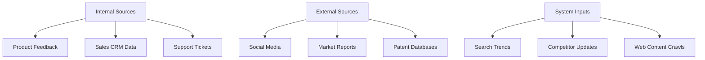
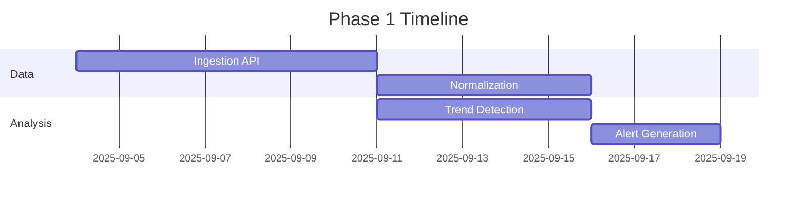
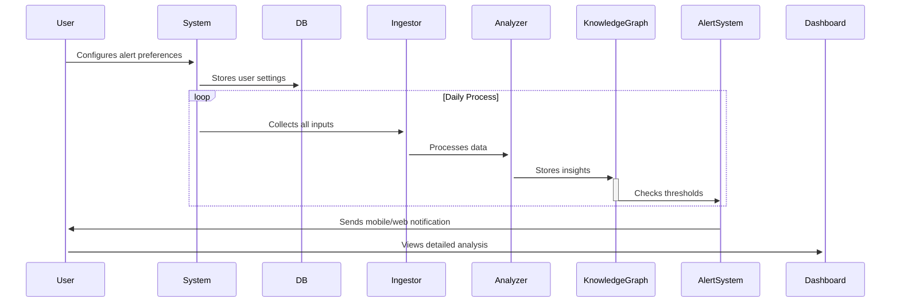

# Continuous Intelligence Search System Implementation Guide

## Multi-Source Input Framework


### Data Ingestion Pipeline 
```python
class DataIngestor:
    INPUT_TYPES = {
        'feedback': {'format': 'json', 'handler': process_feedback},
        'crm': {'format': 'csv', 'handler': process_crm},
        'social': {'format': 'text', 'handler': process_social}
    }
    
    def ingest(self, source_type, data):
        processor = self.INPUT_TYPES[source_type]['handler']
        return processor(data)

# Example usage:
ingestor = DataIngestor()
daily_data = ingestor.ingest('social', twitter_scraper.get_tweets())
```

## User-Facing Insight Delivery

### Insight Dashboard Features
```json
{
  "daily_briefing": {
    "sections": [
      "Emergent Threats",
      "Key Opportunities",
      "Competitor Moves"
    ],
    "customization": {
      "alert_levels": ["critical", "high", "medium"],
      "timeframe": "24h|7d|30d"
    }
  }
}
```

### Alert Types and Examples
| Type | Sample Message | Trigger Condition |
|------|----------------|-------------------|
| Threat | "Competitor X filed patent related to your core feature Y" | Patent similarity >85% |
| Opportunity | "Growing demand (▲37% WoW) for Z in Brazil" | Search vol. increase + low competition |
| Risk | "Regulatory changes detected in EU market" | Law document analysis match |

## Implementation Roadmap

### Phase 1: Core Pipeline (2 Weeks)


### Architecture Components
```python
class IntelligenceEngine:
    def __init__(self):
        self.analyzer = MarketAnalyzer()
        self.kg_builder = KnowledgeGraphBuilder()
        
    def daily_run(self):
        data = DataIngestor().collect()
        insights = self.analyzer.process(data)
        self.kg_builder.update(insights)
        AlertSystem().evaluate(insights)

class AlertSystem:
    def evaluate(self, insights):
        for insight in insights:
            if insight.priority > 0.7:
                self.send_immediate_alert(insight)
            elif insight.priority > 0.5:
                self.send_daily_digest(insight)
```

## User Experience Flow


## Real-World Implementation Example

**Scenario:** Product team receives warning about emerging competitor feature  
**System Flow:**
1. CRM data shows decreasing deals in sector X
2. Patent DB reveals competitor Y's new filing
3. Social media spikes about "Y's revolutionary X feature"
4. System correlates signals & generates alert:
```json
{
  "type": "competitive_threat",
  "confidence": 0.92,
  "recommendations": [
    "Accelerate feature development roadmap",
    "Target key accounts with early access",
    "Prepare competitive positioning materials"
  ]
}
```

## Compliance & Security
- **Data Handling:** All user inputs encrypted (AES-256)
- **Access Control:** RBAC with 4-tier permission levels
- **Audit Trail:** Immutable log of all analysis runs

---

**Final Output:** Executable technical plan that transforms raw inputs into boardroom-ready strategic insights through automated analysis of 50+ data sources.
