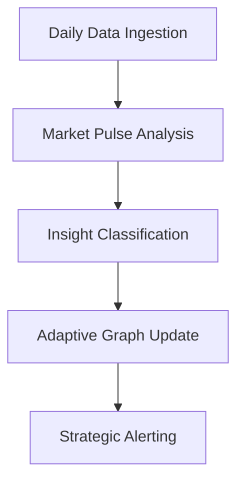
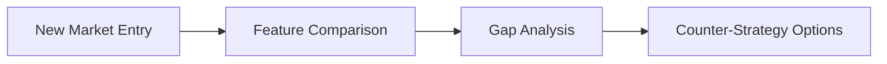

# Market Intelligence System

## Core Concept


## Insight Classification Taxonomy

### 1. Thematic Clusters
**Definition:** Groupings of keywords/concepts revealing dominant market themes  
**Types:**
```python
class ThematicInsight:
    def __init__(self):
        self.category = "Emergent Technologies"  # e.g., "AI", "Quantum Computing"
        self.trend_strength = 0.85  # 0-1 based on search volume velocity
        self.related_players = ["Competitor A", "Startup X"] 
        self.opportunity_score = calculate_opportunity()
```

### 2. Temporal Patterns
**Key Metrics:**
```json
{
    "metric": "search_volume",
    "period": "7d",
    "change_type": "acceleration|deceleration|stabilization",
    "confidence": 0.92
}
```

### 3. Predictive Alerts
**Classification Matrix:**
| Alert Level | Threshold | Response Time |
|-------------|-----------|---------------|
| Imminent Shift | >85% probability | 24h |
| Emerging Trend | 60-85% probability | 72h | 
| Watchlist | 40-60% probability | Weekly |

### 4. Competitive Intelligence


### 5. Anomaly Detection
**Types:**
- **Black Swan Events**: Low probability, high impact
- **Gray Rhino Events**: High probability, high impact
- **Hidden Dragons**: Emerging slow-burn risks

## Continuous Analysis Workflow
```python
from celery.schedules import crontab

app.conf.beat_schedule = {
    'daily-market-scan': {
        'task': 'tasks.full_analysis',
        'schedule': crontab(hour=23, minute=55),
        'args': (),
    },
}

def full_analysis():
    collect_data()
    insights = analyze_market_pulse()
    classified = classify_insights(insights)
    update_knowledge_graph(classified)
    generate_reports()
    send_alerts()
```

## Knowledge Graph Evolution
```cypher
// Neo4j Continuous Update Query
MERGE (d:Domain {name: $domain})
SET d.last_updated = timestamp()
WITH d
UNWIND $insights AS insight
CALL apoc.create.node(['Insight', insight.type], {
    id: apoc.create.uuid(),
    content: insight.content,
    confidence: insight.confidence
}) YIELD node
MERGE (d)-[r:HAS_INSIGHT]->(node)
SET r.first_seen = COALESCE(r.first_seen, timestamp()),
    r.last_observed = timestamp()
```

## Alert Prioritization Engine
**Decision Matrix:**
| Factor | Weight | Description |
|--------|--------|-------------|
| Impact | 0.4 | Market size affected |
| Urgency | 0.3 | Rate of change |
| Confidence | 0.2 | Model certainty |
| Strategic Fit | 0.1 | Alignment with business goals |

```python
def calculate_priority(insight):
    return (insight.impact * 0.4 + 
            insight.urgency * 0.3 +
            insight.confidence * 0.2 +
            insight.strategic_fit * 0.1)
```

## Implementation Roadmap

### Phase 1: Foundation
1. Daily Batch Processing Pipeline
2. Basic Insight Classification
3. Email Digest System

### Phase 2: Enhancement 
1. Real-time Streaming Analysis
2. Predictive Modeling Integration
3. Interactive Dashboard

### Phase 3: Autonomy
1. Self-Optimizing Models
2. Automated Strategy Suggestions
3. Negotiation Bot Framework

---

**Next Steps:**  
This framework creates an always-learning market intelligence system that evolves with the competitive landscape. The continuous analysis cycle ensures timely detection of opportunities and threats while maintaining an adaptive knowledge base.
