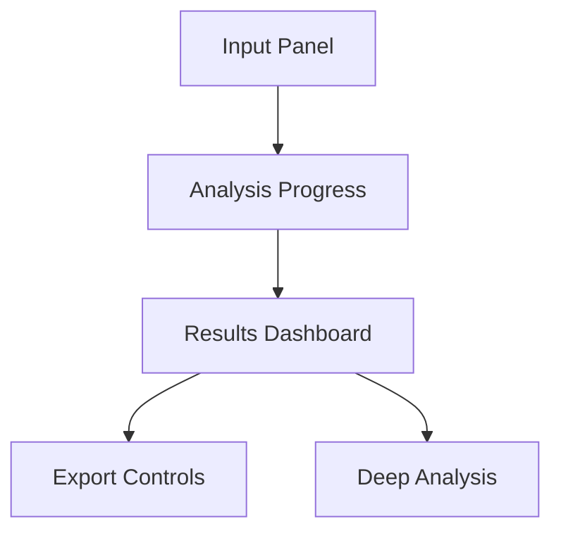

# Enhanced Market Intelligence UI Specification

## Core Interface Components


## Input Section Enhancement
```jsx
function DomainInput() {
  const [domain, setDomain] = useState('');

  return (
    <div className="input-container">
      <h1>Market Insight Engine</h1>
      <div className="input-group">
        <input 
          type="text" 
          placeholder="Enter domain (e.g. example.com)"
          value={domain}
          onChange={(e) => setDomain(e.target.value)}
          aria-label="Domain input"
        />
        <button className="primary-btn">
          <SearchIcon /> Analyze Domain
        </button>
      </div>
      <div className="input-options">
        <button className="secondary-btn">
          <ScheduleIcon /> Schedule Periodic Analysis
        </button>
        <button className="secondary-btn">
          <HistoryIcon /> View Previous Reports
        </button>
      </div>
    </div>
  );
}
```

## Consumer Intent Visualization
```jsx
function IntentSection({ clusters }) {
  return (
    <section className="intent-results">
      <h2>Consumers are searching for:</h2>
      <div className="cluster-grid">
        {clusters.map((cluster, index) => (
          <div key={index} className="cluster-card">
            <div className="cluster-header">
              <h3>{cluster.theme}</h3>
              <span className="trend-indicator">
                {cluster.trend}% ▲
              </span>
            </div>
            <div className="keyword-list">
              {cluster.keywords.slice(0,5).map(keyword => (
                <span className="keyword-pill">{keyword}</span>
              ))}
            </div>
            <button 
              className="expand-btn"
              onClick={() => showClusterDetails(cluster.id)}
            >
              View 35 more keywords →
            </button>
          </div>
        ))}
      </div>
    </section>
  );
}
```

## Error Handling & Validation
```js
const validationSchema = yup.object().shape({
  domain: yup
    .string()
    .required('Please enter a valid domain')
    .matches(
      /^(?!-)[A-Za-z0-9-]+(\.[A-Za-z0-9-]+)*\.[A-Za-z]{2,}$/,
      'Invalid domain format'
    )
});
```

## Theme Configuration
```json
{
  "theme": {
    "colors": {
      "primary": "#2B7EF1",
      "secondary": "#4FB9E3",
      "success": "#48BB78",
      "warning": "#ECC94B",
      "danger": "#F56565"
    },
    "spacing": {
      "sectionPadding": "2rem",
      "cardMargin": "1.5rem"
    }
  }
}
