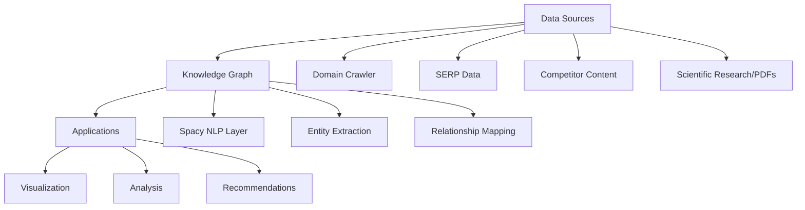

# Knowledge Graph Implementation Plan

## Architecture Overview


## Data Layers

### 1. Spacy NLP Processing Layer
- Entity recognition for:
  - Key terms
  - Named entities
  - Technical concepts
- Dependency parsing for relationship extraction
- Custom pipelines for domain-specific processing

### 2. Domain Crawler
- Full-site crawling with:
  - Breadth-first search
  - Content prioritization
  - Dynamic page handling
- Text extraction from:
  - HTML content
  - Documents (PDF, Word)
  - Structured data (tables, lists)

### 3. SERP Data Integration
- Processing pipeline for:
  - 100,000+ keyword results
  - SERP feature extraction
  - Competitor analysis
- Normalization of:
  - Search volumes
  - Ranking factors
  - Click-through rates

### 4. Competitor Intelligence
- Multi-source crawling:
  - Websites
  - Social media
  - Review platforms
- Sentiment analysis
- Feature/offering comparison

### 5. Scientific/Research Content
- PDF processing with:
  - Text extraction
  - Citation analysis  
  - Concept linking
- Integration with:
  - Academic databases
  - Research repositories
  - Patent filings

## Implementation Roadmap

1. [ ] Phase 1: Core Infrastructure
   - [ ] Graph database setup (Neo4j/GraphQL)
   - [ ] Base schema design
   - [ ] Spacy pipeline configuration

2. [ ] Phase 2: Data Ingestion  
   - [ ] Domain crawler implementation
   - [ ] SERP data processing
   - [ ] PDF/text extraction

3. [ ] Phase 3: Knowledge Construction
   - [ ] Entity resolution
   - [ ] Relationship extraction
   - [ ] Graph enrichment

4. [ ] Phase 4: Applications
   - [ ] Visualization interface
   - [ ] Query API
   - [ ] Recommendation engine

## Technical Requirements

- **Processing Scale**:
  - 1M+ entities
  - 5M+ relationships
  - 100GB+ raw text

- **Performance Targets**:
  - <1s query response for 90% of requests
  - Batch processing of 100k docs/day
  - Real-time updates for key entities

## Integration Points

```python
class KnowledgeGraphBuilder:
    def __init__(self):
        self.nlp = spacy.load("en_core_web_lg")
        self.graph = GraphDatabase()
        
    def add_domain(self, url):
        crawler = DomainCrawler(url)
        texts = crawler.extract_content()
        self.process_texts(texts)
        
    def add_serp_data(self, keyword_results):
        # Process SERP features
        # Extract entities and relationships
        pass
        
    def process_texts(self, texts):
        docs = self.nlp.pipe(texts)
        for doc in docs:
            self._extract_entities(doc)
            self._extract_relations(doc)
