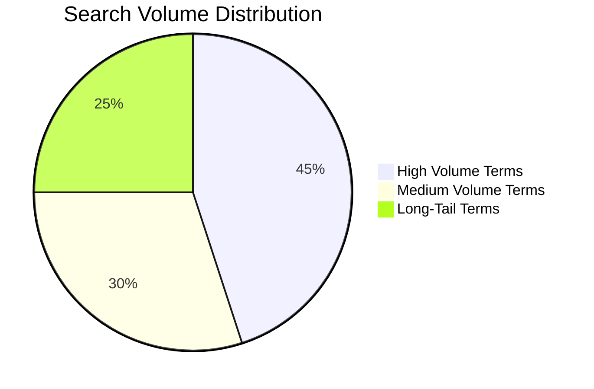

# Customer Search Behavior Analysis

## 1. Search Pattern Analysis

### Core Search Themes
- [Summary of most frequent search patterns]
- [Breakdown by search intent categories]

### Search Volume Distribution


## 2. Purchase Journey Mapping

### Common Search Pathways
1. **Awareness Stage**  
   [Top informational queries]
   - Example: "what is [product/service]"
   - Example: "[problem] solutions"

2. **Consideration Stage**  
   [Top comparison queries]
   - Example: "[product] vs [competitor]"
   - Example: "best [solution] for [use case]"

3. **Decision Stage**  
   [Top transactional queries]
   - Example: "buy [product] online"
   - Example: "[service] pricing"

## 3. Unmet Search Needs

### Gaps in Current Coverage
- [List of frequent searches with low result satisfaction]
- [Emerging search trends not fully addressed]

### Question-Based Searches
- [Top questions users ask about products/services]
- [Questions indicating confusion or information gaps]

## 4. Competitive Landscape

### Competitor-Related Searches
- [Frequency of brand comparisons]
- [Share of voice in key search terms]

## 5. Technical Implementation

### Search Term Validation
```python
def validate_search_term(term):
    """
    Validates search terms against quality criteria:
    - Commercial intent
    - Search volume potential
    - Relevance to offerings
    """
    criteria = {
        'min_word_count': 2,
        'max_word_count': 5,
        'allowed_chars': r"[a-zA-Z0-9\s'-]",
        'banned_patterns': [
            r".*:.*",  # No colons
            r"¿.*\?",  # No explicit questions
            r".*\d{4}"  # No years/dates
        ]
    }
    # Validation logic would go here
```

## 6. Recommendations

### Content Opportunities
1. [Topic clusters to develop]
2. [Informational gaps to fill]

### Product Considerations
- [Features frequently searched but not offered]
- [Terminology mismatches between searches and offerings]

## Appendix: Data Methodology

### Analysis Parameters
| Parameter          | Value               |
|--------------------|---------------------|
| Time Period        | [Date range]        |
| Total Searches     | [Number]            |
| Unique Terms       | [Number]            |
| Data Source        | Google Ads API      |

### Cluster Definitions
- **Commercial Intent**: Searches with clear purchase intent
- **Informational**: Searches seeking knowledge/answers
- **Navigational**: Searches for specific brands/sites
