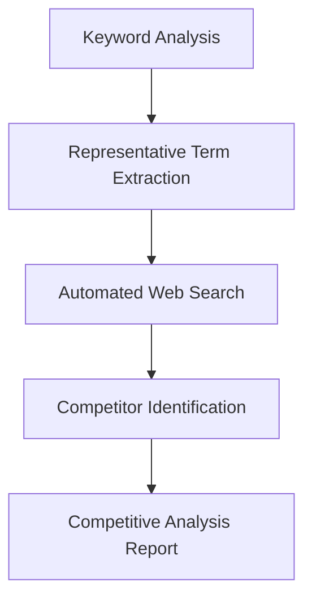

# Competitor Identification Framework

This framework outlines a systematic approach to identify potential competitors by analyzing keyword data and correlating it with real-world search results.

## Workflow Overview



## Phase 1: Keyword Analysis
### Input
- Raw keyword data (`output.csv`)
- Solution focus area (e.g., "cloud data warehousing")

### Process
1. Filter keywords related to the target solution using:
   - Semantic similarity analysis
   - Domain-specific pattern matching
   - Manual curation if needed
2. Analyze keyword metrics:
   - Search volume
   - Commercial intent
   - Geographic distribution
   - Seasonality patterns

### Output
- 500-1000 most representative keywords for the solution

## Phase 2: Automated Web Search
### Process
1. Use headless browser automation to perform searches for each representative keyword
2. Collect search results from the first 3 pages (top 30 results per keyword)
3. Extract:
   - Company names
   - Product names
   - Solution descriptions
   - Pricing information (if available)

### Technical Implementation
```python
from selenium import webdriver
from bs4 import BeautifulSoup

def search_google(keyword):
    driver = webdriver.Chrome()
    driver.get(f"https://www.google.com/search?q={keyword}")
    soup = BeautifulSoup(driver.page_source, 'html.parser')
    
    results = []
    for result in soup.select('div.g'):
        title = result.select_one('h3').text
        url = result.select_one('a')['href']
        snippet = result.select_one('div.IsZvec').text if result.select_one('div.IsZvec') else ''
        results.append({"title": title, "url": url, "snippet": snippet})
    
    driver.quit()
    return results
```

## Phase 3: Competitor Identification
### Process
1. Aggregate search results across all keywords
2. Identify recurring entities:
   - Company names
   - Product names
   - Service providers
3. Categorize entities by:
   - Solution match strength
   - Market presence (frequency in results)
   - Geographic focus

### Competitive Matrix
| Competitor | Solution Match | Market Presence | Key Differentiators |
|------------|----------------|-----------------|---------------------|
| Company A  | High           | 120 mentions    | AI-powered features|
| Company B  | Medium         | 85 mentions     | Lower pricing      |
| Company C  | High           | 95 mentions     | Enterprise focus   |

## Phase 4: Competitive Analysis
### Key Analysis Areas
1. **Feature Comparison**: Map features against your solution
2. **Positioning Analysis**: Understand market positioning
3. **Gap Identification**: Find unmet needs in the market
4. **SWOT Analysis**: Strengths, Weaknesses, Opportunities, Threats

### Output
- Comprehensive competitive landscape report
- Strategic recommendations
- Market opportunity assessment

## Implementation Considerations
1. **Scalability**: Use distributed computing for large keyword sets
2. **Legal Compliance**: Adhere to robots.txt and terms of service
3. **Data Enrichment**: Augment with Crunchbase, LinkedIn, G2 Crowd data
4. **Automation**: Schedule monthly runs to track competitive changes

## Expected Benefits
- Identify both direct and indirect competitors
- Discover emerging players in the space
- Understand market perception of solutions
- Inform product development and positioning
