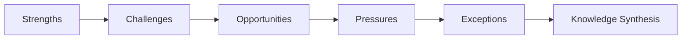
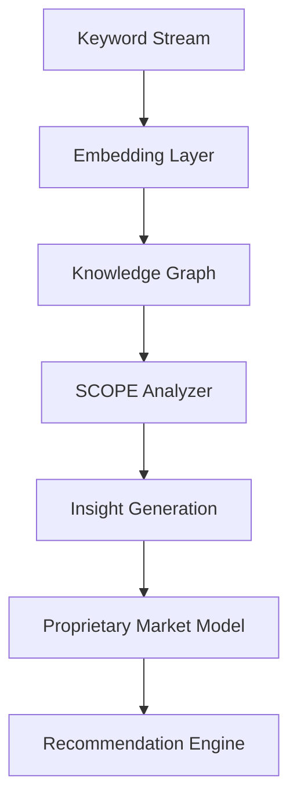
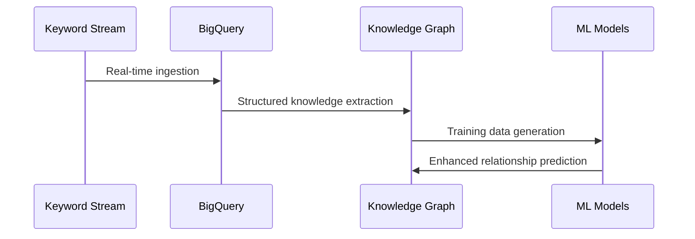

# Domain-Expert Knowledge Generation Framework

## SCOPE Model Integration


### SCOPE Components
1. **Strengths**
   - Core competencies identified in keyword clusters
   - Market positioning advantages
   - Unique value propositions extracted from semantic patterns

2. **Challenges**
   - Competitive threats analysis
   - Market entry barriers detection
   - Technology adoption gaps

3. **Opportunities**
   - Emerging market trends prediction
   - Underserved customer needs identification
   - White space analysis between competitors

4. **Pressures**
   - Regulatory impact assessment
   - Market consolidation signals
   - Pricing pressure indicators

5. **Exceptions**
   - Anomaly detection in market patterns
   - Outlier analysis for disruptive opportunities
   - Contrarian market positioning strategies

## Proprietary Knowledge Generation Engine

### Architecture


### Core Capabilities
1. **Self-Evolving Knowledge Base**
   - Continuous integration of new keyword data
   - Automated relationship discovery in knowledge graph
   - Adaptive learning from market feedback

2. **Predictive Market Modeling**
   ```python
   class MarketModel:
       def __init__(self, domain):
           self.domain = domain
           self.knowledge_graph = self._load_knowledge_graph()
           self.temporal_model = TemporalPredictor()
           
       def predict_market_shift(self, horizon=12):
           """Predict market changes over N months"""
           return self.temporal_model.predict(
               self.knowledge_graph, 
               horizon=horizon
           )
           
       def generate_strategic_insights(self):
           """SCOPE-based strategic recommendations"""
           return SCOPEAnalyzer(self.knowledge_graph).analyze()
   ```

3. **Proprietary Insight Generation**
   - Cross-domain pattern recognition
   - Latent opportunity detection
   - Strategic foresight modeling

## Implementation Framework

### Data Pipeline


### SCOPE Analysis Engine
```python
class SCOPEAnalyzer:
    def __init__(self, knowledge_graph):
        self.kg = knowledge_graph
        
    def analyze(self):
        return {
            "strengths": self._identify_strengths(),
            "challenges": self._detect_challenges(),
            "opportunities": self._discover_opportunities(),
            "pressures": self._assess_pressures(),
            "exceptions": self._identify_exceptions()
        }
    
    def _identify_strengths(self):
        # Query knowledge graph for competency clusters
        query = """
        MATCH (c:Cluster)-[:REPRESENTS]->(s:Strength)
        WHERE s.confidence > 0.85
        RETURN c, s
        """
        return self.kg.query(query)
    
    def _detect_challenges(self):
        # Analyze competitive threat patterns
        ...
        
    # Additional SCOPE component methods
```

## Actionable Outputs
1. **Strategic Playbooks**
   - Market entry strategies
   - Competitive displacement tactics
   - Innovation roadmaps

2. **Predictive Intelligence Reports**
   - Quarterly market shift forecasts
   - Disruption early-warning system
   - Opportunity heatmaps

3. **Automated Decision Frameworks**
   ```mermaid
   graph TD
       I[Input: Market Query] --> P[Proprietary Model]
       P --> A{Action Type}
       A -->|Strategic| S[Playbook Generation]
       A -->|Tactical| T[Execution Plan]
       A -->|Operational| O[Automated Workflow]
   ```

## Knowledge Validation System
1. **Cross-Validation Framework**
   - Historical backtesting of predictions
   - A/B testing of recommendations
   - Expert validation panels

2. **Confidence Metrics**
   ```python
   def calculate_insight_confidence(insight):
       return (
           data_coverage * 0.4 +
           historical_accuracy * 0.3 +
           expert_validation * 0.2 +
           novelty_factor * 0.1
       )
   ```

## Continuous Learning Mechanism
1. **Reinforcement Learning Loop**
   ```mermaid
   flowchart LR
       A[Action Taken] --> R[Result Observed]
       R --> F[Feedback Analysis]
       F --> U[Model Update]
       U --> P[Improved Predictions]
   ```

2. **Knowledge Augmentation**
   - Automated research agent integration
   - Cross-domain knowledge transfer
   - Emerging concept detection
