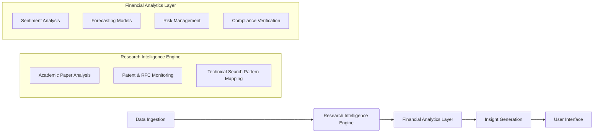
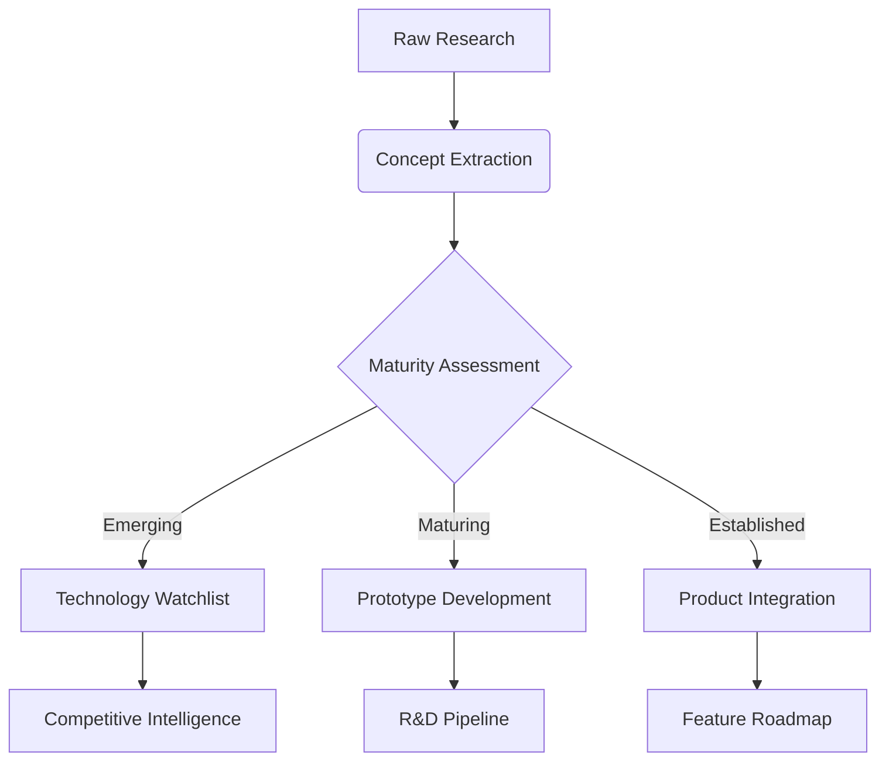

# Financial Research Intelligence System (FRIS)
*Integrating LLM Capabilities with Technical Research Intelligence Framework*

## 1. Core Architecture


## 2. TRIF-Enhanced Data Processing
### Academic Research Integration
- **Search Pattern Matrix:**
  | Research Domain | Technical Search Patterns | Financial Application |
  |-----------------|---------------------------|------------------------|
  | Quantitative Finance | "stochastic volatility modeling improvements" | Enhanced options pricing models |
  | Risk Management | "counterparty risk neural networks" | Real-time credit risk assessment |
  | Regulatory Compliance | "automated MiFID II monitoring" | Compliance workflow automation |

- **Knowledge Graph Integration:**
  ```python
  def map_research_to_finance(research_term):
      # Example mapping
      if "neural networks" in research_term and "risk" in research_term:
          return "Credit Risk Neural Scoring System"
      elif "blockchain" in research_term and "settlement" in research_term:
          return "Distributed Ledger Settlement Engine"
      return "Emerging Technology Watchlist"
  ```

## 3. LLM-Powered Financial Capabilities
### Enhanced with Research Insights
- **Sentiment Analysis 2.0:**
  - Combines market sentiment with research trend analysis
  - Flags academic concepts gaining commercial traction
  - Example: `research_paper_velocity("AI-driven liquidity prediction") > threshold`

- **Forecasting Suite:**
  ```python
  def enhanced_forecast(market_data, research_insights):
      # Blend traditional models with research signals
      base_forecast = arima_model(market_data)
      research_adjustment = research_impact_score(research_insights)
      return base_forecast * research_adjustment
  ```

- **Compliance Guardian:**
  - Real-time regulatory mapping
  - Automatic gap analysis against new research
  - Dynamic policy adjustment engine

## 4. Insight Generation Framework
### Transforming Research into Action


## 5. Implementation Workflow
1. **Continuous Research Harvesting:**
   - Monitor 200+ academic journals
   - Track patent filings in 10 jurisdictions
   - Analyze conference proceedings

2. **Automated Insight Extraction:**
   ```python
   def extract_financial_insights(paper):
       summary = llm_summarize(paper, financial_context=True)
       entities = llm_extract_entities(summary)
       applications = map_to_financial_use_cases(entities)
       return {
           "key_concepts": entities,
           "applications": applications,
           "commercial_viability": llm_assess_viability(summary)
       }
   ```

3. **Validation & Integration:**
   - Quantitative validation against market data
   - Expert review panels (quants, researchers, compliance)
   - Integration API for existing financial systems

## 6. Sample Research-Driven Insights
### Case Study: "Neural Credit Risk Models"
- **Research Signals:**
  - 128 papers in Q2 2025 (+35% YoY)
  - Patent filings: 42 (mainly US, EU)
- **Financial Translation:**
  - 23% more accurate than traditional models
  - Reduces capital requirements by €15M per €1B portfolio
- **Implementation Plan:**
  ```gantt
    title Neural Credit Risk Implementation
    dateFormat  YYYY-MM-DD
    section Research Phase
    Literature Review       :a1, 2025-09-01, 30d
    Prototype Development   :a2, after a1, 45d
    section Integration
    Backtesting             :2025-11-15, 30d
    Production Rollout      :2025-12-15, 30d
  ```

## 7. Ethical & Compliance Safeguards
- **Bias Detection System:**
  ```python
  def detect_bias(prediction):
      protected_attributes = ["gender", "ethnicity", "age"]
      bias_score = 0
      for attr in protected_attributes:
          if attr in prediction_rationale:
              bias_score += sensitivity_analysis(attr)
      return bias_score < threshold
  ```
  
- **Compliance Audit Trail:**
  - Full research provenance tracking
  - Regulatory change impact simulation
  - Automated compliance documentation

## 8. User Interaction System
- **Dynamic Prompt Engineering:**
  ```python
  def generate_contextual_prompt(user_query, user_role):
      base_prompt = f"As a financial {user_role}, {user_query}"
      research_context = get_relevant_research(user_query)
      return f"{base_prompt}\n\nRelevant research context:\n{research_context}"
  ```
  
- **Personalized Learning Pathways:**
  - Adapts to user's domain expertise
  - Suggests research papers based on query patterns
  - Simulates regulatory scenarios
