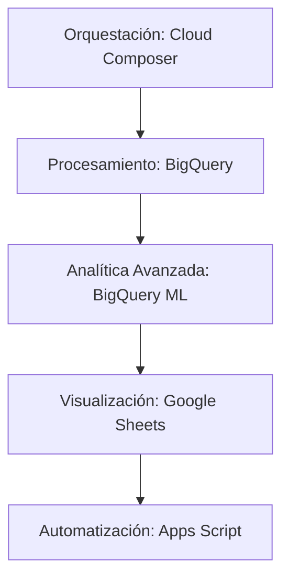
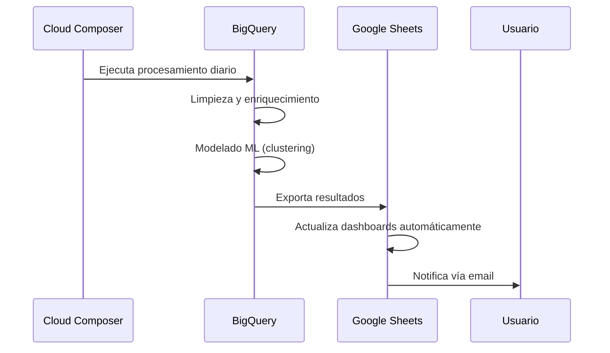

# Framework de Implementación para Análisis de Keywords

## Arquitectura General


## 1. Procesamiento con BigQuery
**Objetivo:** Manejar datasets de 1-10M+ de keywords eficientemente

### Implementación:
- **Estructura de Datos:**
  ```sql
  CREATE TABLE keywords (
    keyword_id STRING,
    keyword STRING,
    domain STRING,
    volume INT64,
    competition FLOAT64,
    cpc FLOAT64,
    trend FLOAT64,
    cluster_id STRING,
    created_at TIMESTAMP
  )
  PARTITION BY DATE(created_at)
  CLUSTER BY domain, cluster_id;
  ```

- **UDFs Esenciales:**
  ```python
  # bigquery_udfs.py
  def semantic_similarity(keyword1, keyword2):
      from sklearn.metrics.pairwise import cosine_similarity
      from sentence_transformers import SentenceTransformer
      model = SentenceTransformer('all-MiniLM-L6-v2')
      emb1 = model.encode([keyword1])
      emb2 = model.encode([keyword2])
      return float(cosine_similarity(emb1, emb2)[0][0])
  ```

- **Flujo de Procesamiento:**
  1. Carga inicial de datos vía `bq load`
  2. Limpieza y normalización con SQL
  3. Enriquecimiento mediante UDFs de Python
  4. Almacenamiento en tablas particionadas

## 2. Orquestación con Cloud Composer (Airflow)
**Objetivo:** Automatizar flujos de procesamiento diarios/semanales

### Implementación:
```python
# airflow_dag.py
from airflow import DAG
from airflow.providers.google.cloud.operators.bigquery import BigQueryExecuteQueryOperator
from datetime import datetime

default_args = {'start_date': datetime(2025, 8, 1)}
dag = DAG('keyword_processing', schedule_interval='0 3 * * *', default_args=default_args)

process_task = BigQueryExecuteQueryOperator(
    task_id='process_keywords',
    sql='sql/process_keywords.sql',
    use_legacy_sql=False,
    dag=dag
)

cluster_task = BigQueryExecuteQueryOperator(
    task_id='cluster_keywords',
    sql='sql/cluster_keywords.sql',
    use_legacy_sql=False,
    dag=dag
)

process_task >> cluster_task
```

## 3. Analítica Avanzada con BigQuery ML
**Objetivo:** Segmentación y análisis predictivo de keywords

### Implementación:
- **Modelado de Clusters:**
  ```sql
  -- sql/cluster_keywords.sql
  CREATE OR REPLACE MODEL `project.keyword_clusters`
  OPTIONS(model_type='KMEANS', num_clusters=50) AS
  SELECT embedding
  FROM ML.PREDICT(MODEL `project.semantic_model`, 
                 TABLE `project.keywords`);
  ```

- **Análisis Predictivo:**
  ```sql
  -- opportunity_score.sql
  SELECT 
    keyword,
    ML.PREDICT(MODEL `project.opportunity_model`,
               STRUCT(volume, competition, cpc)) AS opportunity_score
  FROM `project.keywords`
  ```

## 4. Visualización con Google Sheets + Apps Script
**Objetivo:** Dashboards interactivos para diferentes stakeholders

### Implementación:
- **Conexión BigQuery → Sheets:**
  ```javascript
  // apps_script.js
  function importKeywords() {
    const projectId = 'tu-proyecto';
    const query = 'SELECT * FROM `project.keywords` LIMIT 10000';
    const sheet = SpreadsheetApp.getActiveSpreadsheet().getSheetByName('Keywords');
    
    const results = BigQuery.Jobs.query(projectId, query);
    const rows = results.rows.map(row => row.f.map(cell => cell.v));
    
    sheet.getRange(2, 1, rows.length, rows[0].length).setValues(rows);
  }
  ```

- **Dashboard Interactivo:**
  1. **Hoja Ejecutiva:** 
     - Heatmap de oportunidades por cluster
     - Tendencias temporales clave
  2. **Hoja Táctica:** 
     - Tabla dinámica de keywords por cluster
     - Filtros por dominio/competencia
  3. **Hoja Técnica:**
     - Detalles de modelos ML
     - Métricas de rendimiento

## Flujo de Trabajo Completo


## Requisitos Técnicos
1. **Cuenta de Google Cloud Platform:**
   - Proyecto con BigQuery y Cloud Composer habilitados
   - Límites de cuota aumentados para grandes datasets

2. **Configuración Inicial:**
   ```bash
   # Configuración inicial
   gcloud config set project tu-proyecto
   bq mk keyword_analysis
   gcloud composer environments create keyword-env \
     --location us-central1 \
     --airflow-configs=core-worker_concurrency=10
   ```

3. **Patrones de Costos:**
   | Servicio | Costo Estimado/Mes (10M keywords) |
   |----------|-----------------------------------|
   | BigQuery | $200 (procesamiento + almacenamiento) |
   | Cloud Composer | $350 (entorno básico) |
   | Google Sheets | $0 (hasta 10M celdas) |

## Mejoras Futuras
1. **Streaming en Tiempo Real:** Usar Dataflow para procesamiento continuo
2. **Alerta Temprana:** Detección de anomalías con modelos de serie temporal
3. **Optimización:** Particionado inteligente basado en patrones de acceso
