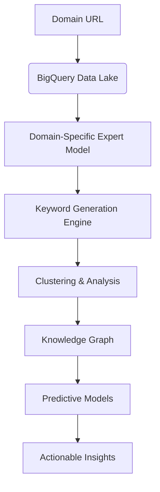
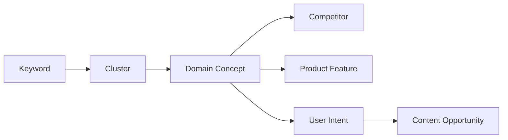
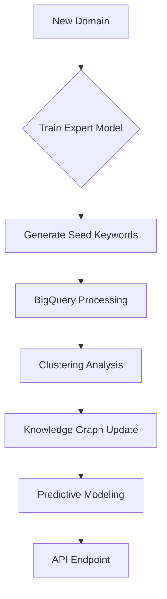

# Machine Learning Framework for Advanced Keyword Analysis

## Core Architecture Components


## Domain-Specific Expert Models
Each domain gets a specialized model trained on:
- Industry-specific terminology
- Regulatory frameworks
- Competitor landscape
- Historical search patterns

**Implementation:**
```python
class DomainExpert:
    def __init__(self, domain):
        self.embedding_model = SentenceTransformer('all-MiniLM-L6-v2')
        self.domain = domain
        self.knowledge_graph = self._load_domain_knowledge()
        
    def _load_domain_knowledge(self):
        # Load domain-specific datasets from BigQuery
        query = f"""
            SELECT * 
            FROM `project.domain_knowledge`
            WHERE domain = '{self.domain}'
        """
        return bigquery.Client().query(query).to_dataframe()
    
    def generate_seed_keywords(self, depth=3):
        # Recursive generation expanding from core concepts
        keywords = self._get_core_terms()
        for _ in range(depth):
            new_keywords = self._expand_layer(keywords)
            keywords.extend(new_keywords)
        return self._filter_and_rank(keywords)
```

## BigQuery Integration Framework
### Data Architecture
```sql
CREATE TABLE keyword_analysis (
    keyword_id STRING,
    keyword STRING,
    domain STRING,
    volume INT64,
    competition FLOAT64,
    cpc FLOAT64,
    embedding ARRAY<FLOAT64>,
    cluster_id STRING,
    generated_at TIMESTAMP
)
PARTITION BY DATE(generated_at)
CLUSTER BY domain, cluster_id;
```

### ML Operations
```sql
-- Create clustering model
CREATE OR REPLACE MODEL `project.keyword_clusters`
OPTIONS(
  model_type='KMEANS',
  num_clusters=50,
  standardize_features = TRUE
) AS
SELECT embedding
FROM `project.keywords`;

-- Predict clusters
SELECT 
  keyword,
  ML.PREDICT(MODEL `project.keyword_clusters`, 
             STRUCT(embedding AS features)) AS cluster_id
FROM `project.keywords`;
```

## Advanced Clustering Methodology

### Hierarchical Density-Based Clustering
```python
from hdbscan import HDBSCAN

def cluster_keywords(embeddings):
    # Parametric UMAP for dimensionality reduction
    reducer = umap.UMAP(n_components=30, metric='cosine')
    reduced_embeddings = reducer.fit_transform(embeddings)
    
    # HDBSCAN with Bayesian optimization
    clusterer = HDBSCAN(
        min_cluster_size=50,
        min_samples=10,
        cluster_selection_epsilon=0.5,
        cluster_selection_method='leaf'
    )
    clusters = clusterer.fit_predict(reduced_embeddings)
    return clusters, clusterer.probabilities_
```

### Cluster Quality Enhancement
1. **Semantic Density Validation**
   - Intra-cluster cosine similarity > 0.85
   - Inter-cluster similarity < 0.4
2. **Outlier Detection**
   - GLOSH scores for noise identification
3. **Dynamic Thresholding**
   - Adaptive clustering params based on domain

## Predictive Keyword Generation

### Long-Tail Expansion Engine
```python
def generate_long_tail(keyword, depth=3):
    # Context-aware expansion using LLMs
    prompt = f"""
    Generate 20 highly specific long-tail keyword variations 
    for "{keyword}" in the {domain} domain. Focus on:
    - Precise user intents
    - Problem/solution patterns
    - Localized terminology
    - Emerging trends
    
    Format as JSON: {{"keywords": ["kw1", "kw2"]}}
    """
    response = llm_client.generate(prompt)
    return json.loads(response)['keywords']
```

### Quality Metrics
1. **Depth Score**: 
   ```math
   Depth = \frac{\sum_{i=1}^{n} \log(volume_i \times specificity_i)}{n}
   ```
2. **Novelty Index**: Measure of unique concepts
3. **Commercial Potential**: `CP = volume × (1 - competition) × CPC`

## Knowledge Graph Integration


## Continuous Learning Framework
1. **Feedback Loop**:
   - User interactions → Reinforcement learning
   - Performance metrics → Model retraining
2. **Automated Validation**:
   - A/B testing of generated keywords
   - Click-through rate monitoring
3. **Domain Adaptation**:
   - Transfer learning between similar domains
   - Incremental model updates

## Deployment Pipeline


## Requirements for Scale
1. **BigQuery ML** for distributed training
2. **Vertex AI Pipelines** for orchestration
3. **GPU Acceleration** for embedding generation
4. **Streaming Data** for real-time analysis
