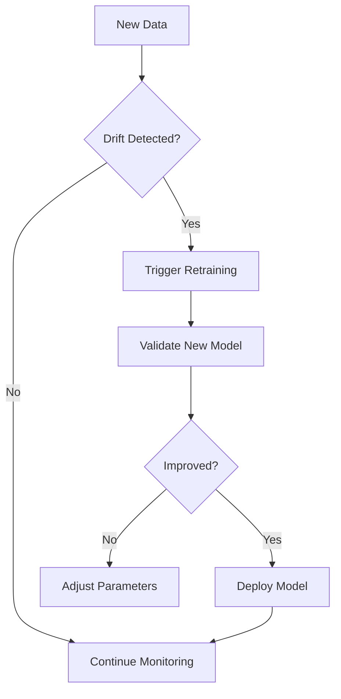

# Machine Learning Model Development Guide

## Phase 1: Data Preparation
### 1.1 BigQuery Data Pipeline
```sql
-- Create optimized dataset
CREATE OR REPLACE TABLE `project.keyword_dataset`
PARTITION BY DATE(created_at)
CLUSTER BY domain, cluster_id AS
SELECT 
  keyword_id,
  keyword,
  domain,
  volume,
  competition,
  cpc,
  ML.GENERATE_EMBEDDING('textembedding-gecko', keyword) AS embedding,
  created_at
FROM `project.raw_keywords`;
```

### 1.2 Feature Engineering
```python
def create_features(keyword_df):
    # Linguistic features
    keyword_df['word_count'] = keyword_df['keyword'].apply(lambda x: len(x.split()))
    keyword_df['char_count'] = keyword_df['keyword'].apply(len)
    keyword_df['avg_word_length'] = keyword_df['keyword'].apply(
        lambda x: sum(len(word) for word in x.split()) / len(x.split())
    )
    
    # Semantic features
    keyword_df['topic_similarity'] = calculate_topic_similarity(keyword_df['keyword'])
    keyword_df['novelty_score'] = calculate_novelty(keyword_df['keyword'])
    
    # Commercial features
    keyword_df['opportunity_score'] = (
        keyword_df['volume'] * 
        (1 - keyword_df['competition']) * 
        keyword_df['cpc']
    )
    return keyword_df
```

## Phase 2: Model Development
### 2.1 Model Selection Matrix
| Model Type | Use Case | BigQuery Implementation | Pros | Cons |
|------------|----------|-------------------------|------|------|
| **K-Means** | Initial clustering | `CREATE MODEL ... OPTIONS(model_type='KMEANS')` | Fast, scalable | Spherical clusters only |
| **HDBSCAN** | Density-based clusters | Python UDF with Scikit-learn | Finds irregular shapes | Requires dimensionality reduction |
| **BERT-based** | Semantic similarity | `ML.GENERATE_EMBEDDING` | State-of-the-art accuracy | Higher compute cost |
| **XGBoost** | Opportunity prediction | `CREATE MODEL ... BOOSTED_TREE` | Handles mixed data types | Less interpretable |

### 2.2 Implementing HDBSCAN in BigQuery
```python
# bigquery_udf.py
from hdbscan import HDBSCAN
import umap
import numpy as np

def cluster_keywords(embeddings):
    # Dimensionality reduction
    reducer = umap.UMAP(
        n_components=min(50, len(embeddings)-1), 
        metric='cosine',
        n_neighbors=15
    )
    reduced_emb = reducer.fit_transform(np.array(embeddings))
    
    # Adaptive clustering
    min_cluster_size = max(10, int(len(embeddings)*0.01))
    clusterer = HDBSCAN(
        min_cluster_size=min_cluster_size,
        min_samples=5,
        cluster_selection_epsilon=0.3,
        cluster_selection_method='leaf'
    )
    return clusterer.fit_predict(reduced_emb).tolist()
```

## Phase 3: Model Training
### 3.1 BigQuery ML Training
```sql
-- Train opportunity prediction model
CREATE OR REPLACE MODEL `project.opportunity_model`
OPTIONS(
  model_type='BOOSTED_TREE_REGRESSOR',
  input_label_cols=['opportunity_score'],
  data_split_method='AUTO_SPLIT',
  max_iterations=1000
) AS
SELECT
  * EXCEPT(keyword_id, created_at),
  opportunity_score
FROM `project.keyword_dataset`
WHERE volume > 100;
```

### 3.2 Vertex AI Custom Training
```yaml
# vertex_ai_config.yaml
trainingPipeline:
  displayName: "domain-expert-training"
  modelToUpload:
    displayName: "legal-domain-expert"
    containerSpec:
      imageUri: "gcr.io/cloud-aiplatform/training/tf-cpu.2-6:latest"
  trainingTaskDefinition: "custom_task"
  trainingTaskInputs:
    workerPoolSpecs:
      - machineSpec:
          machineType: "n1-standard-8"
          acceleratorType: "NVIDIA_TESLA_T4"
          acceleratorCount: 1
        replicaCount: 1
        containerSpec:
          imageUri: "gcr.io/your-project/domain-expert-trainer:latest"
          command: ["python", "train_domain_expert.py"]
```

## Phase 4: Evaluation & Validation
### 4.1 Evaluation Metrics
| Metric | Formula | Target Value |
|--------|---------|--------------|
| **Cluster Quality** | Silhouette Score | > 0.6 |
| **Prediction Accuracy** | R² Score | > 0.85 |
| **Novelty Detection** | Precision@K | > 0.9 |
| **Keyword Expansion** | Depth Score | > 7.0 |

### 4.2 Automated Validation Pipeline
```python
def evaluate_model(model, test_data):
    results = {}
    
    # Regression metrics
    predictions = model.predict(test_data)
    results['r2'] = r2_score(test_data['opportunity_score'], predictions)
    results['mae'] = mean_absolute_error(test_data['opportunity_score'], predictions)
    
    # Cluster metrics
    results['silhouette'] = silhouette_score(
        test_data['embedding'], 
        test_data['cluster_id']
    )
    
    # Novelty detection
    results['precision@10'] = calculate_precision_at_k(
        test_data, 
        k=10, 
        novelty_threshold=0.8
    )
    return results
```

## Phase 5: Deployment
### 5.1 BigQuery ML Deployment
```sql
-- Create endpoint for predictions
CREATE MODEL `project.prod_opportunity_model`
OPTIONS(MODEL_TYPE='BOOSTED_TREE_REGRESSOR') AS
SELECT * FROM `project.opportunity_model`;

-- Predict in production
SELECT
  keyword,
  ML.PREDICT(MODEL `project.prod_opportunity_model`, STRUCT(*)) AS opportunity
FROM new_keywords;
```

### 5.2 Vertex AI Endpoint
```python
# Deploy model endpoint
endpoint = model.deploy(
    deployed_model_display_name='domain-expert-v1',
    machine_type='n1-standard-4',
    accelerator_type='NVIDIA_TESLA_T4',
    accelerator_count=1
)

# Generate keywords via endpoint
response = endpoint.predict(instances=[{
    'domain': 'legal',
    'seed_keywords': ['contract management', 'compliance']
}])
```

## Phase 6: Monitoring & Maintenance
### 6.1 Drift Detection
```sql
-- Monitor data drift
CREATE MONITORING JOB `keyword_drift_monitor`
ON TABLE `project.keyword_dataset`
OPTIONS(
  feature_columns=['volume', 'competition', 'cpc'],
  drift_threshold=0.15,
  drift_window='7d'
);
```

### 6.2 Retraining Pipeline


## Best Practices
1. **Version Control**: Track datasets, models, and code with DVC
2. **Reproducibility**: Use Docker containers for custom training
3. **Cost Control**: Set BigQuery budget alerts
4. **Security**: Encrypt sensitive data with Cloud KMS
5. **Testing**: Implement CI/CD for ML pipelines
