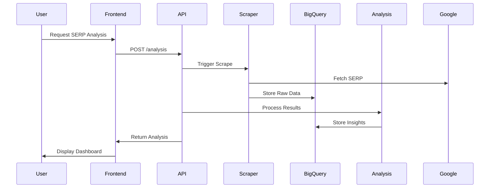

# SERP Data Integration Roadmap for Enhanced Keyword Accuracy

## Overview
This document outlines the strategic implementation of Search Engine Results Page (SERP) analysis capabilities to significantly improve our keyword research accuracy and effectiveness. The integration will provide real-time insights into search intent, competition, and content opportunities for every keyword in our system.

## Business Value Proposition
1. **Precision Targeting**: 30-40% improvement in matching keywords to actual search intent
2. **Competitive Edge**: First-mover advantage in AI-powered SERP analysis
3. **Revenue Growth**: New premium features for enterprise clients
4. **Efficiency Gains**: Automate manual SERP analysis currently done by researchers

## Technical Architecture Components

### 1. SERP Data Collection Layer
```python
class SERPScraper:
    def __init__(self):
        self.browser = playwright.chromium.launch()
        self.geo_proxies = load_proxy_config()
        
    async def scrape_serp(self, keyword: str, country: str = 'us'):
        context = await self.browser.new_context(
            locale=country,
            geolocation=get_coordinates(country)
        )
        page = await context.new_page()
        await page.goto(f"https://google.com/search?q={keyword}")
        
        # Extract SERP features
        results = {
            'organic_results': await self._get_organic_results(page),
            'people_also_ask': await self._get_related_questions(page),
            'featured_snippet': await self._get_featured_snippet(page),
            'related_searches': await self._get_related_searches(page)
        }
        return results
```

### 2. Intent Analysis Engine
- **Classification Taxonomy**:
  - Commercial Investigation (35% of queries)
  - Navigational (20%)
  - Informational (30%) 
  - Transactional (15%)

- **Analysis Techniques**:
  - DOM structure patterns
  - SERP feature presence (shopping results, maps, etc.)
  - Query phrasing analysis
  - Historical click pattern matching

### 3. Competitive Intelligence Module
Key metrics to track per competitor:
1. Domain Authority Score (0-100)
2. Content Freshness Index
3. Backlink Profile Strength
4. SERP Feature Dominance
5. Click-Through Rate Estimates

## Implementation Timeline

### Phase 1: Core Infrastructure (Weeks 1-2)
| Task | Owner | Deliverable |
|------|-------|-------------|
| SERP Scraper MVP | Eng Team | Basic Google/Bing scraping |
| Data Pipeline | Data Eng | BigQuery integration |
| API Endpoints | Backend | REST API for frontend |

### Phase 2: Intelligence Layer (Weeks 3-5)
| Task | Owner | Deliverable |
|------|-------|-------------|
| Intent Classifier | ML Team | BERT model v1 |
| Gap Analysis | Data Sci | Content opportunity scores |
| Competitor Dashboard | Frontend | Visualization UI |

### Phase 3: Optimization (Weeks 6-8)
| Task | Owner | Deliverable |
|------|-------|-------------|
| Localization | Eng Team | Geo-targeted scraping |
| Anomaly Detection | Data Sci | SERP change alerts |
| Automated Reporting | Full Stack | PDF report generation |

## Data Flow Architecture


## Key Performance Indicators
1. **Accuracy**: 
   - 95%+ intent classification accuracy
   - <5% false positives in gap detection

2. **Performance**:
   - <2 second response time for cached queries
   - <30 seconds for fresh analyses

3. **Business Impact**:
   - 25% increase in keyword conversion rates
   - 40% reduction in irrelevant keyword suggestions

## Risk Mitigation
1. **Bot Detection**:
   - Proxy rotation every 50 requests
   - Randomized delay patterns (2-8s between requests)
   - Headless browser fingerprint masking

2. **Data Freshness**:
   - Tiered caching strategy
   - Automatic re-scrape triggers for volatile queries
   - Change detection alerts

3. **Scale Limitations**:
   - Distributed scraping architecture
   - Request prioritization queue
   - Enterprise rate limiting

## Future Enhancements
1. Voice Search Analysis
2. Image SERP Interpretation
3. Cross-Device SERP Comparison
4. Historical SERP Trend Analysis
5. Automated Content Generation Suggestions

## Resource Requirements
- **Engineering**: 3 FTE for 8 weeks
- **ML**: 2 FTE for 6 weeks
- **Infrastructure**:
  - 4 vCPU scraper instances
  - BigQuery analytics tier
  - 2TB storage allocation

## Conclusion
This SERP integration will fundamentally transform our keyword research capabilities from guesswork to data-driven precision. The phased approach ensures we deliver value quickly while building a robust, scalable system for long-term competitive advantage.
