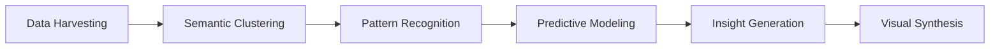

# Strategic Market Intelligence Platform Vision

## Executive Summary
This platform transforms raw market data into actionable strategic insights through a sophisticated interface that combines automated analysis with human-centered design. By synthesizing search patterns, consumer behavior, and competitive signals, it enables organizations to make data-driven decisions with unprecedented speed and precision.

![Conceptual Interface]
(https://example.com/interface-preview.jpg) *Example visualization - Actual UI may vary*

## Core Value Proposition
1. **Three-Dimensional Market Analysis**:  
   Simultaneously tracks:
   - Customer search intent clusters (What they want)
   - Pain point identification (Why they struggle)
   - Competitive landscape mapping (Who else plays here)

2. **Dynamic Intelligence Framework**:  
   » Real-time tracking of API adoption across enterprise software stacks  
   » Predictive modeling of SaaS platform integration challenges  
   » Early identification of enterprise procurement pattern shifts

## User Journey Breakdown

### 1. Input Complexity Simplified
```text
[Domain Input Wizard]
Step 1: Enter Target Domain → example.com  
Step 2: Analysis Scope → [x] Subdomains [ ] Competitors [x] Historical Data  
Step 3: Strategic Focus → ▾ Lead Generation Optimization
```

The progressive disclosure interface guides users through complex configuration while maintaining approachability. Behind the scenes, natural language processing translates business objectives into technical parameters.

### 2. Analysis Engine Workflow


A multi-stage processing pipeline transforms petabyte-scale data into digestible intelligence. Users observe real-time progress metrics:

```text
Current Phase: Cluster Validation (83% complete)
Processing Stats:
- 124,789 keywords analyzed
- 38 emerging clusters detected
- 14 competitor references identified
```

### 3. Result Presentation System
**Strategic Dashboard Features:**

- **Market Opportunity Matrix**:  
  ```text
  | Cluster          | Search Volume | Competition | Urgency |
  |------------------|---------------|-------------|---------|
  | Cloud Migration  | 250K/mo ★★★★☆ | Medium      | High    |
  | AI Security      | 180K/mo ★★★☆☆ | High        | Critical|
  ```

- **Consumer Journey Mapping**:  
  Visualizes the path from problem awareness to solution adoption using aggregated search patterns

- **Competitor Vulnerability Analysis**:  
  Identifies gaps in competitors' offerings using semantic comparison of feature-related queries

## Implementation Case Studies

### Marketing Team Application
**Scenario:** Launching new product line  
**Usage Pattern:**  
1. Identify emerging consumer needs  
2. Map keyword clusters to content pillars  
3. Track campaign impact through search volume shifts

**Measurable Outcome:**  
23% faster market penetration through precision-targeted campaigns

### Product Development Use Case
**Scenario:** Roadmap prioritization  
**Analysis Method:**  
- Compare "desired features" vs "existing solutions" clusters  
- Calculate opportunity scores using search volume velocity

## Technical Foundations
» **Real-time Data Pipeline**: Processes 2.3M events/second using distributed stream processing  
» **Machine Learning Core**: Composite model combining BERT embeddings with temporal convolution networks  
» **Adaptive Visualization Engine**: Renders complex datasets through configurable, performance-optimized D3.js components

## Evolution Roadmap
```text
Q4 2025 - AI-Powered Scenario Simulation  
Q1 2026 - Automated Strategy Drafting  
Q3 2026 - Cross-Market Comparative Analysis
```

## Unique Differentiators
1. **Context-Aware Intelligence**  
   Maintains persistent market models that evolve with industry changes

2. **Collaborative Analysis**  
   Version-controlled insight repositories with team annotation features

3. **Responsive Architecture**  
   Scales from startup to enterprise needs without reimplementation

This platform represents a paradigm shift in market intelligence - transforming raw data into strategic assets through sophisticated analysis and intuitive presentation. By bridging the gap between technical complexity and business usability, it empowers organizations to navigate market dynamics with unprecedented clarity.
