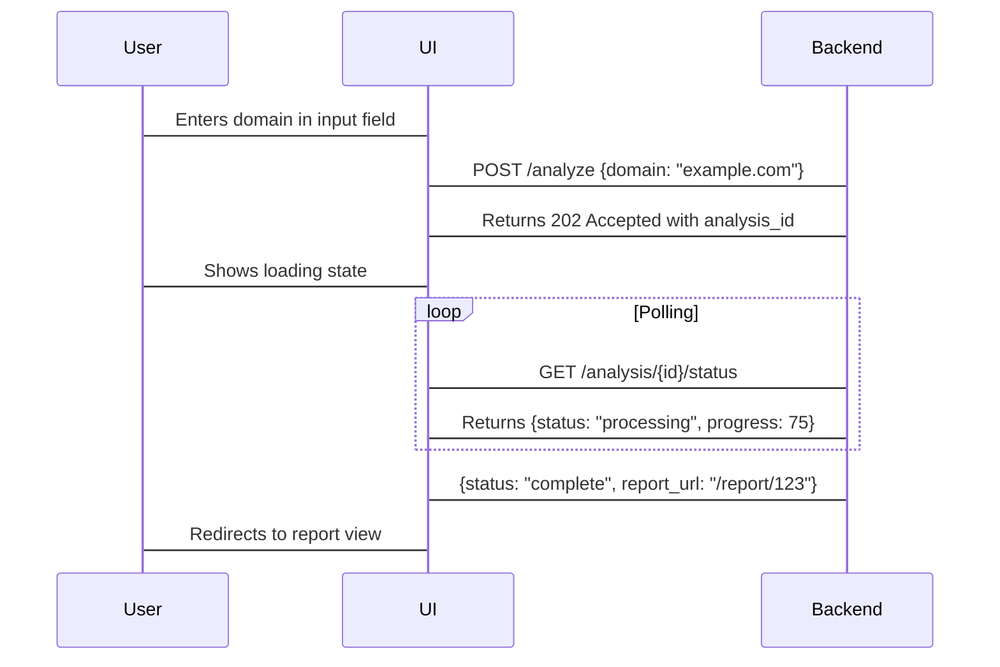

# Market Intelligence Service UI Specification

## Core User Flow


## UI Components

### 1. Input Panel (React Component)
```jsx
function DomainInput() {
  const [domain, setDomain] = useState('');
  const [isLoading, setIsLoading] = useState(false);

  const handleSubmit = async () => {
    setIsLoading(true);
    const { analysisId } = await api.startAnalysis(domain);
    // Polling logic and redirection
  };

  return (
    <div className="input-panel">
      <h2>Market Intelligence Analysis</h2>
      <input 
        type="text" 
        placeholder="Enter domain (e.g. example.com)"
        value={domain}
        onChange={(e) => setDomain(e.target.value)}
      />
      <button onClick={handleSubmit} disabled={!domain || isLoading}>
        {isLoading ? 'Analyzing...' : 'Get Domain Analysis'}
      </button>
    </div>
  );
}
```

### 2. Result Visualization
```jsx
function AnalysisResult({ data }) {
  return (
    <div className="results-container">
      <div className="intent-section">
        <h3>Consumers are searching for:</h3>
        <ClusterList clusters={data.solutionClusters} type="solution"/>
      </div>
      
      <div className="problem-section">
        <h3>Key problem areas detected:</h3>
        <ClusterList clusters={data.problemClusters} type="problem"/>
      </div>
    </div>
  );
}

function ClusterList({ clusters, type }) {
  return (
    <div className={`clusters ${type}`}>
      {clusters.map(cluster => (
        <div key={cluster.id} className="cluster-card">
          <h4>{cluster.theme}</h4>
          <KeywordCloud keywords={cluster.keywords} />
          <p>Search Volume Trend: ▲ {cluster.volumeChange}%</p>
        </div>
      ))}
    </div>
  );
}
```

### Interaction States
```css
/* Loading animation */
@keyframes pulse {
  0% { opacity: 1; }
  50% { opacity: 0.5; }
  100% { opacity: 1; }
}

.loading-indicator {
  animation: pulse 2s infinite;
}

/* Error state */
.error-banner {
  background: #ffebee;
  border-left: 4px solid #c62828;
  padding: 1rem;
}
```

## Personalization Features

### User Preferences Panel
```json
{
  "preferences": {
    "alertThreshold": 0.65,
    "language": "en",
    "metricUnits": {
      "volume": "percentage",
      "velocity": "absolute"
    },
    "competitorTracking": ["comp1.com", "comp2.net"]
  }
}
