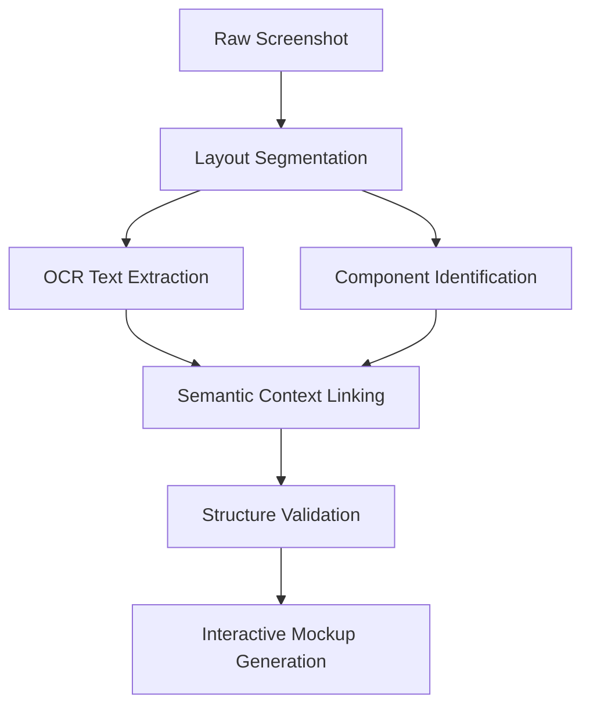

# Visual UI Analysis Protocol for LLMs

## Image Processing Pipeline


## Processing Stages

1. **Layout Segmentation**
```python
def detect_ui_regions(image):
    """Identifies functional UI areas using CV-based detection"""
    return {
        'input_section': {'coordinates': [120, 80, 600, 200]},
        'results_section': {'coordinates': [50, 250, 800, 800]}
    }
```

2. **Component Annotation**
```json
{
  "detected_components": [
    {
      "type": "input_field",
      "label": "Domain entry",
      "position": {"x": "20%", "y": "15%"},
      "properties": {
        "placeholder": "example.com",
        "button_label": "Analyze Domain"
      }
    }
  ]
}
```

## Multi-Modal Analysis Example
**Visual Input** (text-based representation):
```
[Input Panel]
┌─────────────────────────┐
│ Analyze Domain: [_____] │
└─────────────────────────┘

[Results Section]
► Consumers want: Feature X (▲25%)
► Problems found: Issue Y (▼12%)
```

**LLM Processing Prompt:**
```text
Analyze this UI design mockup. Identify the core components 
and their relationships. Output JSON with:

1. Main user flow stages
2. Detected interactive elements
3. Information hierarchy
4. Missing elements based on standard patterns
```

**Expected API Response:**
```json
{
  "analysis": {
    "user_flow": ["input", "processing", "results"],
    "key_components": [
      {
        "name": "domain_input",
        "type": "text_field",
        "connected_to": "results_section"
      }
    ],
    "hierarchy_score": 0.87,
    "recommended_additions": ["progress_indicator"]
  }
}
```

## Validation Checklist
```text
1. Cross-reference detected text with UI component library
2. Verify spatial relationships between elements
3. Check brand consistency in detected color schemes
4. Validate interactive element functionality
