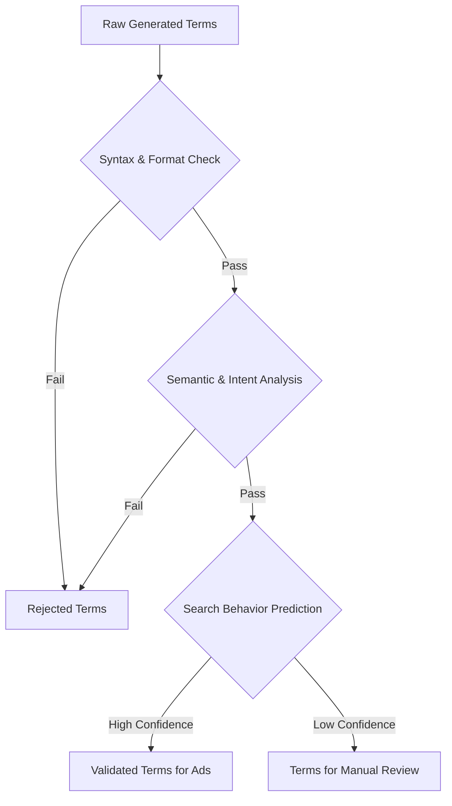

# Search Term Prediction and Validation Framework

## 1. Problem Analysis

The current keyword generation process produces terms that are not always suitable for the Google Ads API. Key issues include:

- **Poor Formatting**: Terms with colons, question marks, or other special characters are often rejected.
- **Low Commercial Intent**: Abstract concepts or informational queries that do not convert well.
- **Incorrect Structure**: Phrases that do not resemble actual user search queries.

This framework aims to solve these issues by implementing a robust validation and prediction pipeline.

## 2. Term Classification Taxonomy

We will classify generated terms into distinct categories to handle them appropriately:

- **High-Value Commercial Queries**: Direct product/service searches (e.g., "buy digital wallet").
- **Informational Queries**: Users seeking information (e.g., "what is a digital wallet"). These can be valuable for content strategy but may not be ideal for direct ad spend.
- **Question Phrases**: Valid search queries formatted as questions (e.g., "how to secure a digital wallet"). These are acceptable if they reflect genuine user searches.
- **Problem Patterns (to be filtered)**:
  - Meta-commentary ("analysis of...", "comparison of...").
  - Abstract concepts without clear search intent.
  - Poorly structured phrases with incorrect punctuation.

## 3. Validation Pipeline Architecture

A multi-stage validation pipeline will ensure only high-quality terms are used:



## 4. Implementation Components

### 4.1. Syntax & Format Validator

A rule-based validator to perform initial filtering.

```python
def validate_syntax(term):
    # Rule 1: No invalid special characters (allow hyphens, apostrophes)
    if re.search(r"[^\w\s'-]", term):
        return False
    # Rule 2: Word count between 2 and 7
    if not 2 <= len(term.split()) <= 7:
        return False
    # Rule 3: No isolated punctuation
    if term.strip() in ["?", "!", ":"]:
        return False
    return True
```

### 4.2. Semantic & Intent Classifier

A fine-tuned LLM or a traditional machine learning model (e.g., SVM, Gradient Boosting) trained to classify terms based on:

- **Search Intent**: Navigational, Informational, Transactional.
- **Commercial Viability**: A score from 1-10 indicating conversion likelihood.
- **Specificity**: How niche or broad the term is.

### 4.3. Search Behavior Predictor

This component will use historical data from Google Ads and analytics to predict the performance of a new term.

- **Input Features**: Term text, semantic classification, competition level, etc.
- **Output**: Predicted CTR, Conversion Rate, CPC.
- **Model**: Regression model (e.g., Linear Regression, Random Forest).

## 5. Training Data Requirements

- **Labeled Search Terms**: A dataset of at least 10,000 search terms, labeled as "valid" or "invalid" for Google Ads.
- **Performance Data**: Historical Google Ads data including impressions, clicks, conversions, and cost for a wide range of keywords.
- **Web Analytics Data**: User engagement metrics for different search terms from web analytics platforms.

## 6. Integration Approach

1.  **Pre-generation Constraints**: Add strict formatting and content constraints to the initial LLM prompt to guide the generation process.
2.  **Post-generation Validation**: Pass all generated terms through the validation pipeline.
3.  **Continuous Learning**: Regularly retrain the prediction models with new performance data to improve accuracy over time. The system should automatically flag underperforming term patterns and add them to the rejection filter.
